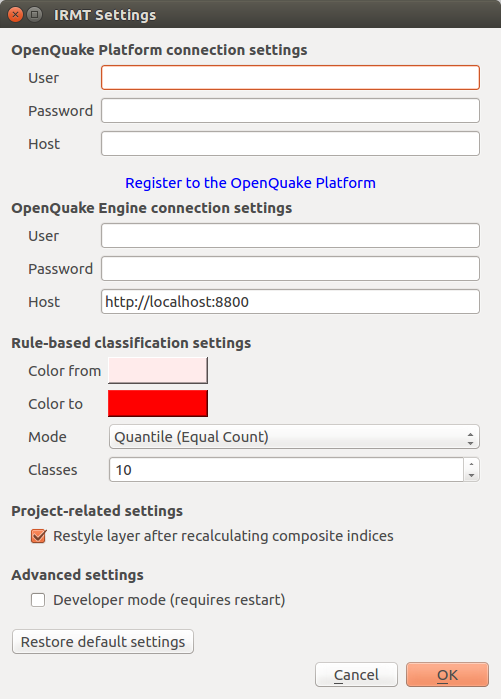

.. _chap-connection-settings:

**************************************
OpenQuake Platform connection settings
**************************************

.. _fig-connection-settings:

    
    |icon-connection-settings| OQ-Platform connection settings

Some of the functionalities provided by the plugin, such as the ability to work
with GEM data, require the interaction between the plugin itself and the
OpenQuake Platform (OQ-Platform). The OQ-Platform is a web-based portal to
visualize, explore and share GEM's datasets, tools and models. In the *Platform
Settings* dialog displayed in :numref:`fig-connection-settings`,
credentials must be inserted to authenticate the user and to allow the user to
log into the OQ-Platform. In the *Host* field insert the URL of GEM's
production installation of the `OQ-Platform <https://platform.openquake.org>`_
or a different installation if you have URL access. If you still haven't registered
to use the OQ-Platform, you can do so by clicking *Register to the OQ-Platform*.
This will open a new web browser and a `sign up page
<https://platform.openquake.org/account/signup/>`_. The checkbox labeled
*Developer mode (requires restart)* can be used to increase the verbosity of
logging. The latter is useful for developers or advanced users because logging
is critical for troubleshooting, but it is not recommended for standard users.

.. |icon-connection-settings| image:: images/iconConnectionSettings.png
