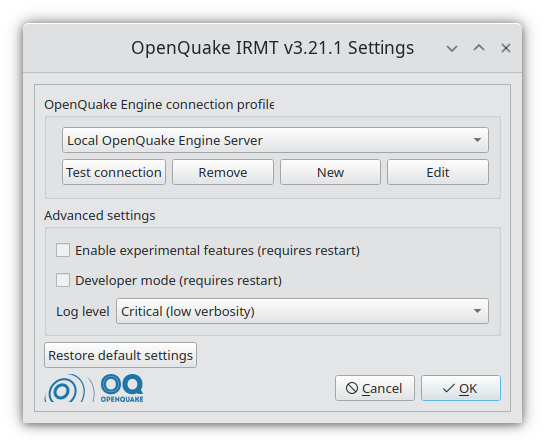

.. _chap-irmt-settings:

*************
OpenQuake IRMT settings
*************

.. _fig-plugin-settings:

    
    |icon-plugin-settings| OpenQuake IRMT settings

Some of the functionalities provided by the plugin, such as the ability to work
with GEM data, require the interaction between the plugin itself and the
OpenQuake Platform (OQ-Platform) or the OpenQuake Engine (OQ-Engine).

The OQ-Platform is a web-based portal to visualize, explore and share GEM's
datasets, tools and models. In the :guilabel:`OpenQuake IRMT Settings` dialog displayed
in :numref:`fig-plugin-settings`, credentials must be inserted to
authenticate the user and to allow the user to log into the OQ-Platform. In the
:guilabel:`Host` field insert the URL of GEM production installation of the
`OQ-Platform <https://platform.openquake.org>`_ or a different installation if
you have URL access. If you still haven't registered to use the OQ-Platform,
you can do so by clicking :guilabel:`Register to the OQ-Platform`.  This will
open a new web browser and a `sign up page
<https://platform.openquake.org/account/signup/>`_.

.. _fig-connection-profile:

    
    Connection profile

The `OQ-Engine <https://github.com/gem/oq-engine>`_ is an open source
application that allows users to compute seismic hazard and seismic risk of
earthquakes on a global scale. It can run locally on the user's machine, or on
a remote workstation or cluster. The `OQ Engine Server
<https://github.com/gem/oq-engine/blob/master/doc/running/server.md>`_ provides
an HTTP RESTful API. The OpenQuake IRMT plugin leverages this API to enable the user to
drive the OQ-Engine directly from within QGIS. In order to interface the plugin
with a running OQ Engine Server, it is necessary to insert in this dialog the
user credentials (if they are required by the server) and the web URL where the
service is hosted (see :numref:`fig-connection-profile`). By default, the host
is set to `http://localhost:8800`, meaning that the plugin will attempt to
connect to a OQ Engine Server running locally, on port `8800`.

It is possible to create multiple connection profiles, and to edit or
remove existing ones. For instance, you might want to use alternatively an OpenQuake
Engine Server running on your local machine and a remote one running on a cluster.
For this purpose, you can create the two connection profiles, and then select
one or the other from the :guilabel:`OpenQuake Engine connection profile` dropdown
menu. The buttons :guilabel:`Test connection` can be used to check if the
plugin is able to connect to the corresponding server using the specified
host name and credentials.

When the plugin loads an OQ-Engine hazard/risk map as a layer or when integrated risk
indices are calculated, the corresponding map is automatically styled applying a rule-based
classification with the parameters specified in the
:guilabel:`Rule-based classification settings`.
By default, whenever composite indices are calculated, the rule-based classification
is applied and the layer is styled accordingly. On a project level, it is
possible to avoid restyling the layer at each recalculation of the
composite indices, by unchecking the corresponding option.

Advanced settings
-----------------

The checkbox labeled :guilabel:`Enable experimental features (requires restart)`
enables some functionalities of the plugin that are still experimental and not
completely tested. It is not recommended for standard users.

It is possible to change the verbosity of the plugin log, by selecting a
:guilabel:`Log level` in the corresponding dropdown menu. Levels are:

* Info (high verbosity): whatever is notified to the user through the message
  box in the graphical user interface, will be also printed in the log.
* Warning (medium verbosity): only critical messages (errors) and warnings will
  be printed in the log.
* Critical (low verbosity): only critical messages (errors) will be printed in
  the log.

The checkbox labeled :guilabel:`Developer mode (requires restart)` can be used
to log additional information for debugging purposes. It is useful for developers or
advanced users for troubleshooting, but it is not recommended for standard users.

The button :guilabel:`Restore default settings` can be used to discard the
settings customized by the user and to replace them with the factory defaults.
Please be aware that such operation, once confirmed, can not be undone.

.. |icon-plugin-settings| image:: images/iconPluginSettings.png
