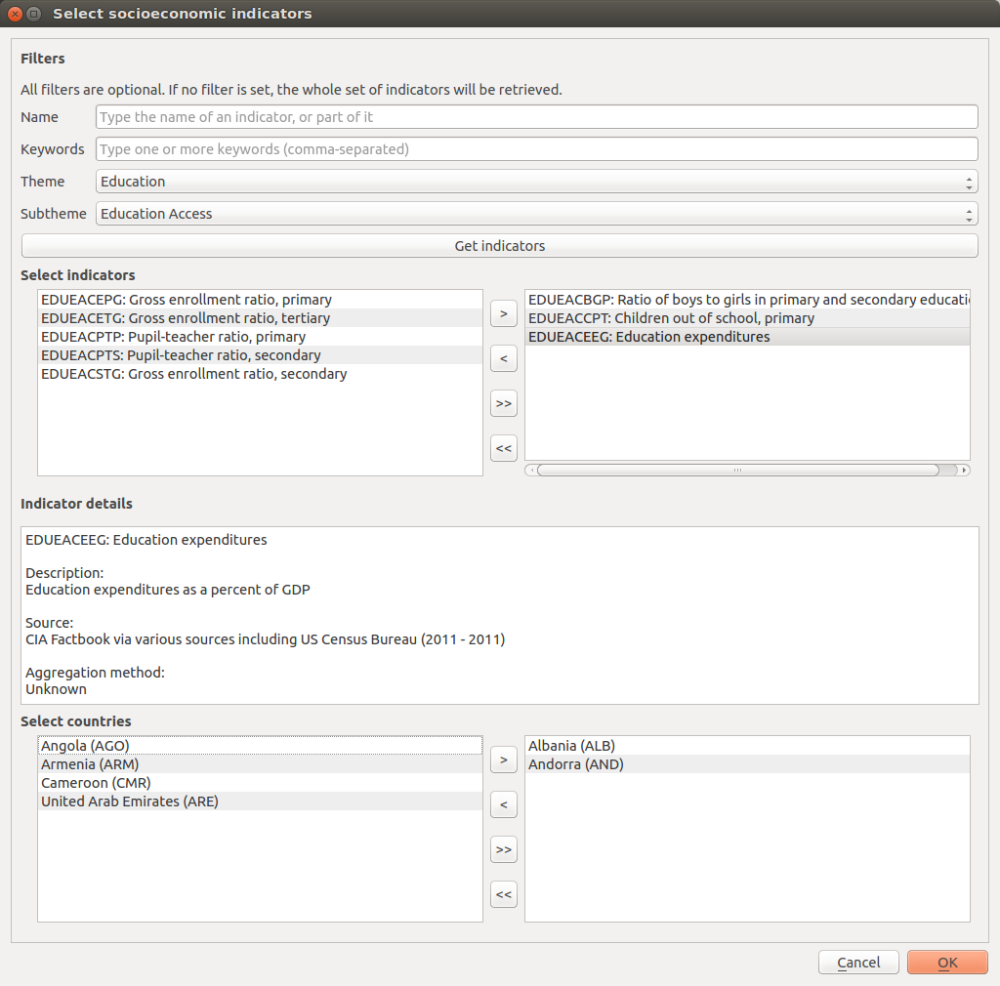
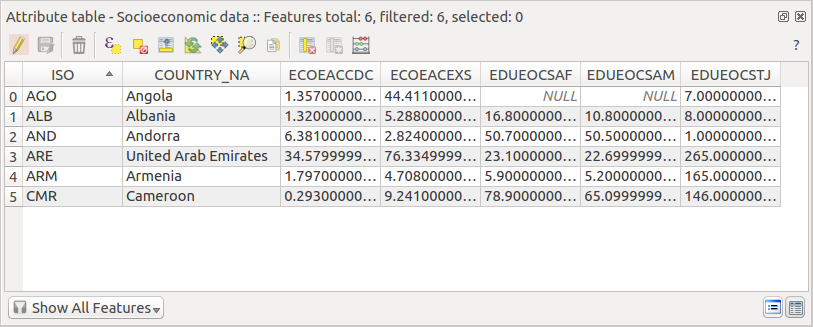

************************************************************
Loading socioeconomic indicators from the OpenQuake Platform
************************************************************

.. _fig-load-indicators-from-platform:

    
    |icon-load-indicators| Socio-economic indicators selection portal

The selection of data comprises an essential step for an assessment of risk
from an integrated and holistic perspective using indicators. The strengths and
weaknesses of composite indicators are derived to a great extent by the quality
of the underlying variables. Ideally, variables should be selected based on
their relevance to the phenomenon being measured, analytical soundness,
accessibility, and completeness [NAR2008]_. Proxy measures for
social and economic vulnerability have been provided by the Global Earthquake
Model that have been stringently tested for representativeness, robustness,
coverage and analytical soundness [KHA2014]_. Integrated Risk
Modelling Toolkit and Database for Earthquake Risk Assessment. Proceedings of
the Second European Conference on Earthquake Engineering and Seismology,
European Association of Earthquake Engineering and European Seismological
Commission, Istanbul, Turkey}. These are currently accessible in the IRMT at
the national level of geography (gadm L1). Future software releases will add
access to data at gadm level 2 (L2) for a selection of countries and regions.
This will include the eight Andean countries of South America and countries
within Sub-Saharan Africa.

Figure :ref:`fig-load-indicators-from-platform`. displays the *Select
Socioeconomic Indicators* dialog that was developed to allow users to select
indicators based on a number of factors and filtering mechanisms. A
*Filters* section was developed to enable users to filter indicators by
name, keywords, theme (e.g. Economy) and subtheme (e.g Resource Distribution
and Poverty). The *subtheme* dropdown menu is automatically populated depending
on the selection of a respective theme. When *Get indicators* is
pressed, a list of filtered indicators is populated on the left side of the
dialog within the *Select indicators* window. If no filters are set, then the
whole list of indicators available within the database is retrieved and
displayed within the *Select indicators* window.

From the *Select indicators* window, it is possible to select one or more
indicators by single-clicking them in the *Unselected* list on the left.
Double-clicking the selected indicator(s) moves them to the *Selected* list on
the right, and the corresponding data will be downloaded from the OQ-Platform.
Another way to move items to the right, or back to the left, is to use the four
central buttons (*add the selected items*, *remove the selected items*, *add
all*, *remove all*). The *Indicator details* section displays information about
the last selected indicator: code, short name, longer description, source and
aggregation method.

The *Select countries* dialog contains the list of enumeration types (in this
case countries) that socioeconomic data is available for within the database.
Countries can be selected from the list in the same manner that indicators are
selected using *Select indicators*. Once at least one indicator and one country
has been selected, the *OK* button will be enabled. By pressing the *OK*
button, data will be downloaded from the OQ-Platform and compiled into a vector
shapefile for display and manipulation within QGIS (another dialog will ask you
where to save the shapefile that will be obtained). The layer will contain
features equal to the number of selected countries and will contain all
attributes selected as indicators for the given countries. Additional
attributes will include fields containing country ISO codes and country names.
To reduce processing time, detailed country geometries were simplified using
ESRI's `Bend Simplify algorithm
<http://resources.arcgis.com/en/help/main/10.1/index.html#//007000000010000000>`_.
Bend Simplify removes extraneous bends and small intrusions and extrusions
within an area's topology without destroying its essential shape.

.. _fig-attribute-table:

    
    Layer attribute table

Figure :ref:`fig-attribute-table` shows the attribute table of a sample vector
layer compiled and downloaded within the IRMT. Note that for some countries the
values of indicators might be unavailable (or NULL). When the tool downloads
the socioeconomic data, a project definition is automatically built taking into
account how the data was organized in the socioeconomic database. At the
country level data was grouped together by these meaning that indicators
belonging to the same theme will be grouped together in a hierarchical
structure. This structure considers: 1) vulnerable populations; 2) economies;
3) education; 4) infrastructure; 5) health; 6) governance and institutional
capacities; and 7) the environment.

.. [KHA2014]
    Khazai B, Burton C.G., Tormene, P., Power, C., Bernasocchi, M., Daniell,
    J., and Wyss, B. (2014)
    Integrated Risk Modelling Toolkit and Database for Earthquake Risk
    Assessment. Proceedings of the Second European Conference on Earthquake
    Engineering and Seismology, European Association of Earthquake Engineering
    and European Seismological Commission, Istanbul, Turkey.

