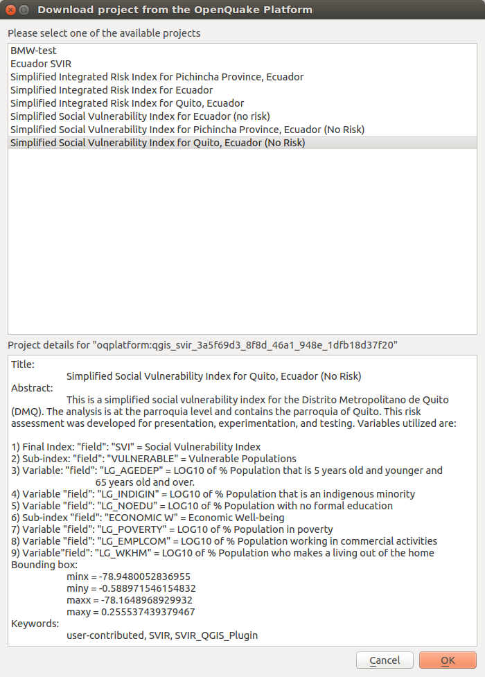

*************************************************
Downloading a project from the OpenQuake Platform
*************************************************

.. _fig-download-project-from-platform:

    
    Downloading a project from the OpenQuake Platform

An additional option to access data is by downloading projects shared by others
on the OQ-Platform. By clicking the *Download project from the OpenQuake
Platform*, the above dialog is opened (Figure
:ref:`fig-download-project-from-platform`). Here, a list of available projects
is displayed. The list will contain the titles of projects for which the user
has been granted editing privileges (their own projects or those shared with
them by other users). When a project is selected from the list, its title,
abstract, bounding box and keywords are displayed in the lower textbox that is
utilized to delineate important attributes of the project's definition.  The
label directly above the textbox displays an ID that uniquely identifies the
layer used in the OpenQuake-platform.

By pressing *OK*, the layer will be downloaded into the QGIS. If the associated
project only contains one *project definition*, it will be automatically be
selected and downloaded. Otherwise, the project definition manager will open
(see :ref:`chap-project-definitions-manager`) allowing the user
to choose one of the available project definitions. Once a project definition
is selected, the composite indicators delineated within the project definition
are re-calculated, and the layer is styled and rendered accordingly. This
process may take some time, depending on the complexity of the project.
