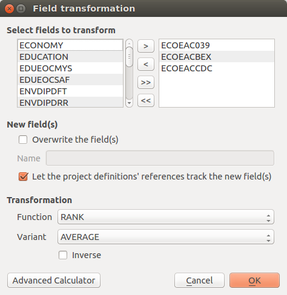

***********************
Transforming attributes
***********************

.. _fig-transform-attribute:

    |icon-transform-attributes| Variable transformation and batch transformation functionality

Once variables are selected, they should be standardized or normalized before
they are aggregated into composite indicators. This is because variables are
delineated in a number of statistical units that could easily consist of
incommensurate ranges or scales. Variables are standardized to avoid problems
inherent when mixing measurement units, and normalization is employed to avoid
having extreme values dominate an indicator, and to partially correct for data
quality problems. The QGIS platform natively provides a *Field calculator* that
can be used to update existing fields, or to create new ones, in order to to
perform a wide variety of mathematical operations for the
standardization/transformation of data. In addition, the  IRMT provides a
number of transformation functions found in popular statistical and
mathematical modelling packages (Table :ref:`tab-transformation-functions`).

.. _tab-transformation-functions:

.. table:: Selection of transformation functions with equations found in the IRMT.

  =============================  =================================================================================================================================
  Standardization (or Z-scores)  :math:`Z(x_i) = \frac{x_i-\mu_x}{\sigma_x} \; (\mu_x = mean \; \sigma_x = stddev)`
  Min-Max                        :math:`M(x_i) = \frac{x_i - \min_{i \in \{1,\dots,n\}}(x_i)}{\max_{i \in \{1,\dots,n\}}(x_i) - \min_{i \in \{1,\dots,n\}}(x_i)}` 
  Logistig Sigmoid               :math:`S(x_i) = \frac{1}{1 + e^{-x_i}}`
  Simple Quadratic               :math:`Q(x_i) = \frac{x^2}{\max_{i \in \{1,\dots,n\}}(x_i)}`
  =============================  =================================================================================================================================

These include:

1. **Data Ranking** is the simplest standardization technique.
   Ranking is not affected by outliers and allows the performance of
   enumeration units to be benchmarked over time in terms of their relative
   positions (rankings).
 
2. **Z-scores (or normalization)** is the most common standardization
   technique. A Z-score converts indicators to a common scale with a mean of
   zero and standard deviation of one. Indicators with outliers that are
   extreme values may have a greater effect on the composite indicator. The
   latter may not be desirable if the intention is to support compensability
   where a deficit in one variable can be offset (or compensated) by a surplus
   in another.
 
3. **Min-Max Transformation** is a type of transformation that
   rescales variables into an identical range between 0 and 1. Extreme
   values/or outliers could distort the transformed risk indicator. However,
   the MIN-MAX transformation can widen a range of indicators lying within a
   small interval, increasing the effect of the variable on the composite
   indicator more than the Z-scores.
 
4. **Log10** is one of a class of logarithmic transformations that
   include natural log, log2, log3, log4, etc. Within the current plugin, we
   offer functionality for log10 only, yet these transformations are possible
   within the advanced *field calculator*. A logarithm of any negative number
   or zero is undefined. It is not possible to log transform values within the
   plugin if the data contains negative values or a zero. For values of zero,
   the tool will warn users and suggest that a :math:`1.0` constant be added to move
   the minimum value of the distribution.
 
5. **Sigmoid function** is a transformation function having an *S*
   shape (sigmoid curve). A Sigmoid function is used to transform values on
   :math:`(-\infty, \infty)` into numbers on :math:`(0, 1)`. The Sigmoid function is often
   utilized because the transformation is relative to a convergence upon an
   upper limit as defined by the S-curve. The IRMT utilizes a *simple sigmoid
   function* as well as its inverse. The Inverse of the Sigmoid function is a
   logit function which transfers variables on :math:`(0, 1)` into a new variable on
   :math:`(-\infty, \infty)`.
 
6. **Quadratic or U-shaped functions** are the product of a
   polynomial equation of degree 2. In a quadratic function, the variable is
   always squared resulting in a parabola or U-shaped curve. The IRMT offers
   an increasing or decreasing variant of the quadratic equation for
   horizontal translations and the respective inverses of the two for vertical
   translations.

Please note that it may be desirable to visualize the results of the
application of transformation functions to data. Although not feasible within
the plugin at this point, we intend to build data plotting and curve
manipulating functionalities into into future versions of the toolkit.   

The *Transform attribute* dialog (Figure :ref:`fig-transform-attribute`) was
designed to be quite straightforward. The user is required to select one or
more numeric fields (variables) available in the active layer. For the
selection to be completed, the user must move the variables (either one at a
time, or in a batch) to the *Selected variables* window on the right side of
the interface. The user must then select the function necessary to transform
the selected variables. For some functions, more than one variant is available.
For functions that have an implementation of an inverse transformation, the
*Inverse* checkbox will be enabled to allow users to invert the outcome of the
transformation.

The *New field(s)* section contains two checkboxes and a text field. If the
first checkbox *Overwrite the field(s)* is selected, the original values of the
transformed fields will be overwritten by the results of the calculations;
otherwise, a new field for each transformed variable will be created to store
the results. In situations in which a user may desire to transform variables
one at a time rather than using a batch transformation process, it is possible
for the user to name each respective new field (editing the default one
proposed by the tool). Otherwise, the names of the new fields will be
automatically assigned using the following convention: if the original
attribute is named *ORIG\_NAME*, the name of the transformed attribute becomes
*T\_ORIG\_NAM* (prepending *T\_* and truncating to 10 characters which is the
maximum length permitted for field names in shapefiles).

If the checkbox *Let the project definitions* references track the new FIXME
field(s)' is checked, all the project definitions associated with the active
layer will reference the transformed fields instead of the original ones.
Otherwise, they will keep the links to the original selected attributes. In
most cases it is recommended to keep this checkbox checked. This automatic
update of field references simplifies the workflow because it avoids the need
to manually remove the original nodes from the weighting and aggregation tree
(discussed in detail in Chapter~\ref{chap:weighting_and_calculating}) in
order to add the transformed nodes and to set again the nodes' weights. In
other words, if a project was developed by weighting and aggregating
untransformed indicators, this functionality allows for variables used in the
project definition to be replaced on-the-fly (and automatically) by transformed
variables.  This saves the user from having to augment the model manually.  

By clicking the *Advanced Calculator* button, the native QGIS field calculator
is opened.  Please refer to
`transformation_algs.py
<https://github.com/gem/oq-irmt-qgis/blob/master/svir/calculations/transformation_algs.py>`_
for the detailed documentation of all the agorithms and variants provided by
the IRMT.

