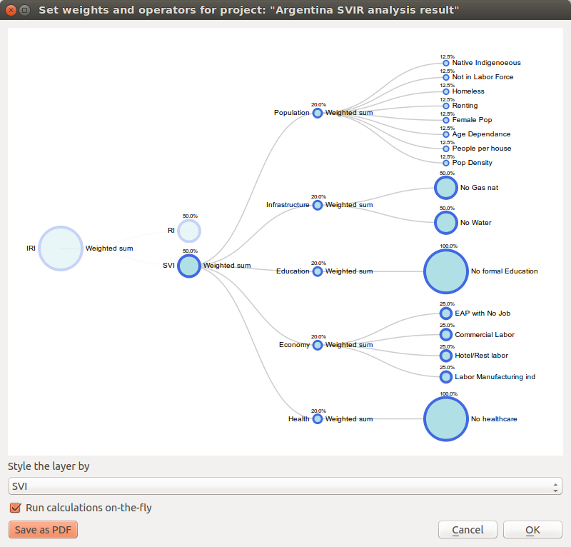
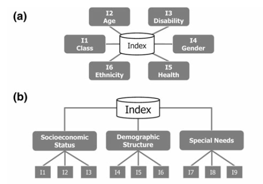

.. _chap-weighting-and-calculating:

**************************************
Weighting data and calculating indices
**************************************

.. _fig-weighting-and-calculating:

    |icon-weight-and-calculate| Tree chart structure for the development of composite indicators

Central to the construction of composite indicators is the need to meaningfully
combine different data dimensions, and consideration must be given to weighting
and aggregation procedures. Most composite indicators rely on equal weighting
largely for simplicity. Equal weighting, however, implies that all variables
within the composite indicator are of equal importance when this may not
actually be the case. The issue of aggregation is similar to the weighting
process. Different aggregation rules may be applied depending on the underlying
theoretical framework chosen by the user for the modelling process.
Sub-indicators may be summed up (linear aggregation) for instance, multiplied,
or geometrically aggregated to correct for compensability (i.e., the possibility
of offsetting a deficit in some dimension with an outstanding performance in
another). Each technique has specific consequences, implies different
assumptions, and could ignore or incorporate weights.

The :guilabel:`Weight data and calculate indices` widget
(:numref:`fig-weighting-and-calculating`) is the key module of the IMRT. It
contains the model building functionality of the OpenQuake IRMT, and it is used to
create, edit, and manage composite indicator(s) and integrated risk model
development. It provides users with an intuitive way to develop composite
models by building and editing the selected project definition through the use
of a dynamic graphical interface that was developed explicitly to guide the
construction of composite indicators in a manner that is simple, visual, and
straight-forward. The latter is accomplished through a window that embeds a
dynamic model builder that takes the form of a tree chart (see
:numref:`fig-weighting-and-calculating`).  This structure (or weighting and
aggregation tree) defines a workflow that strings together sequences of steps
to describe how variables are combined together to obtain the composite
indices.  

.. _fig-composite-indicator-types:

    Composite indicator types

Currently, the OpenQuake IRMT supports the development of two composite model types: a)
deductive and, b) hierarchical (:numref:`fig-composite-indicator-types`
[#citation]_).
Deductive models typically contain fewer than ten indicators that are
normalized and aggregated to create an index. Hierarchical models typically
employ ten to twenty indicators that are separated into groups (sub-indices)
that share the same underlying dimension of a concept (in this case
socio-economic parameters of earthquake risk such as population, economy,
infrastructure, education, and governance).  Individual indicators are
aggregated into sub-indices (e.g., population, economy, etc.), and the
sub-indices are aggregated to form a final composite index (e.g., social
vulnerability or integrated risk index). The tree structure of the
:guilabel:`Weight data and calculate indices` widget encourages the development of hierarchical
models of integrated risk. The starting point is a *root node* that corresponds
to the development of a hierarchical model that can be: 1) an *Integrated Risk
Index* (IRI) which is a function of the aggregation of a *Social Vulnerability
Index* (SVI) and a *Risk Index* (RI); or 2) a *Social Vulnerability Index*
(SVI) that is the result of the aggregation of various sub-indicators defined
by the user (e.g., Economy, Education, and Environment as shown within
:numref:`fig-weighting-and-calculating`).  The tree can be modified
dynamically by adding or removing nodes, *inverting* variables, setting a
weight to each variable or node and choosing the operators to be used to
combine variables together.

.. note::

    The dialog can be resized, and it is possible to pan and zoom within the
    tree area using your mouse. By pressing :guilabel:`Save as PDF`, and
    specifying the destination file, the project representation can be printed
    as PDF.

Whenever :guilabel:`Update` or :guilabel:`Update and close` are clicked, the project definition is
updated and the composite indices are re-calculated. As a consequence, the map
is rendered and styled accordingly. This allows the user to have an immediate
feedback on how the map changes depending on how the project definition is set.
Such automatic re-calculations and rendering can take some time, depending on
the complexity of the project and number of enumeration units analysed.
Sometimes it is more convenient to disable the on-the-fly calculations while
changing the project structure, and enable it again once the project has been
built. In order to do so, it is sufficient to toggle the :guilabel:`Run
calculations on-the-fly` checkbox.

The main functional elements of the weighting and aggregation tree are
discussed in the subsections below.

Adding a node
=============

Individual nodes correspond to aggregated composite indicators within the
weighting and aggregation tree. To add a node (i.e., a composite sub-indicator)
within the tree, it is possible to begin by left-clicking on the default node
(i.e., SVI).  Clicking on the default SVI node allows the addition of multiple
new sub-indicators, each with its own user-provided name.

.. note::

    It is not possible to add nodes stemming from the IRI.

When a newly created node is
clicked, a new dialog is initiated to give users the option to select the
variables available in the layer (and not already used in the node) to populate
the sub-indicator being under construction. The dropdown menu to select the
field name displays, for each field, the corresponding alias (where available).
When a field is selected, the proposed name to be displayed in the tree is
set by default equal to the field alias (if available) or equal to the field
name.

.. note::

    The SVI can be calculated if each socioeconomic sub-indicator has at least
    one variable.

In order to add an indicator to one of the socioeconomic sub-indicators, you
can click on the corresponding node. When adding an indicator to the RI, or to
one of the socioeconomic sub-indicators, the description of the node will be
automatically set to be equal to the name of the corresponding layer's
variable. Users can edit this description, however, by clicking on the text
displayed next to the node in the tree and then by clicking within the
corresponding textbox to change the text.

Removing a node
===============

In order to remove one of the nodes from the tree, users can perform a
right-click on that node. A popup dialog window will ask you to confirm if you
really intend to delete the node and all of its *children* (the lower level
nodes connected to it).

.. note::

    Removing a node from the tree will *not* delete the corresponding field
    from the layer.

.. _sec-setting-operators:

Setting the operators to be used to aggregate variables
=======================================================

On the right of each node, the tree indicates the name of the operator to be
used to combine (or aggregate) the variables making up the node. By clicking on the
operator name, a dialog to set weights and operators is opened. The same
happens when clicking on the name of one of the children nodes. The operator
can be chosen from a dropdown menu. Some operators (e.g., :guilabel:`Weighted sum`) take
into account the weights applied to the child nodes. Other operators (e.g.,
:guilabel:`Average (ignore weights)`) do not take into account weights. When the chosen
operator is one of the latter, the child nodes will be rendered on the
graphical display all with the same radius and their weights will not be
rendered (see :numref:`fig-weighting-and-calculating` for a demonstration of
how the radius of nodes corresponds with the respective weights of variables).
Otherwise, the radius of a node is proportional to its weight, and the weight
is rendered next to the node.

The following table lists the basic operators available in the plugin.
Each formula assumes that we are combining a set :math:`x` of :math:`n` variables
(tree nodes), and that each variable :math:`x_i` has been assigned a weight :math:`w_i`.
Each weight is defined in the interval :math:`[0, 1]` and the sum of all weights is 1
(:math:`\sum\limits_{i=1}^n w_i = 1`).

====================================== ===================================================================================================================
Operator                               Formula
====================================== ===================================================================================================================
Simple sum (ignore weights)            :math:`\sum\limits_{i=1}^n x_i`
Weighted sum                           :math:`\sum\limits_{i=1}^n w_i x_i`
Average (ignore weights)               :math:`\frac {1}{n}\sum\limits_{i=1}^n {x_i}`
Simple multiplication (ignore weights) :math:`\prod\limits_{i=1}^n x_i`
Weighted multiplication                :math:`\prod\limits_{i=1}^n w_i x_i`
Geometric mean (ignore weights)        :math:`\sqrt[n]{\prod\limits_{i=1}^n x_i}`
====================================== ===================================================================================================================

In case the user wants to combine indices using a customized formula that is
not included in the set of the available operators, it is possible to select
from the dropdown menu the item :guilabel:`Use a custom field`, and to specify
which one of the layer fields has to be used to store the data. If nothing
else is specified, the tool will not modify the contents of the selected field
anymore, assuming that the user will take full responsibility in performing the
customized calculation and storing the results in that field. In order to keep
track of the workflow, it is possible to add a :guilabel:`Field description` of
how the node is calculated. Optionally, the user can also specify the
:guilabel:`Custom formula` used to calculate the field. The formula must be in
the same format used by the QGIS Field Calculator, i.e., a valid `QgsExpression`.
If the tool accepts the formula as valid, the node will be recalculated usin that
formula, whenever the project definition is modified. Otherwise (if either the
formula is not specified or it is invalid), the node will not be recalculated,
therefore its values will remain unchanged.

.. note::

    When using a custom operator, we suggest first to create the corresponding
    field using the QGIS Field Calculator, and to set the project definition
    afterwards. The expression that is used within the field calculator can
    be copied and pasted into the :guilabel:`Custom formula` text field. This
    ensures the plugin will recalculate the node afterwards using the same
    valid expression.

Setting weights
===============

Central to the construction of composite indicators in the need to combine data
which implies decisions on weighting. The dialog to
set weights is opened in the same way as described in
:ref:`sec-setting-operators`. Several weighting techniques are
available, and some make use of statistical models.  For the OpenQuake IRMT we
implemented a simple solution to weighting that is often based on the results
of participatory approaches. A weight can be edited manually by clicking on its
value and overwriting it with a new value. A weight can also be edited by
clicking on the spinner arrows to increase or decrease the weight. By
clicking :guilabel:`Update`, the weights will be re-calculated in order to make them sum
to 1. In other words, if you have 3 variables and you set their weights to 1, 2
and 5 and you press :guilabel:`Update`, the weights will be re-calculated to be
respectively 0.125, 0.250 and 0.625, keeping the same proportion between each
other, and summing to 1.

.. TODO: The weighthing process might be improved and perhaps a figure might be
         added, describing how to set weights

Inverting a variable
====================

The dialog to invert variables is opened in the same way as described in
:ref:`sec-setting-operators`. If a variable contributes in a
*negative* way to the composite indicator (e.g., a higher education
corresponding to a lower social vulnerability), it is possible to indicate such
an inverse relationship by pressing the :guilabel:`Invert` button next to the variable
name. The effect on a composite indicator in response to this decision process
and setting is that each value of an *inverted* variable will be to
multiplied by -1 each time the variable is used in a calculation.

.. note::

    Please note that the layer field will keep holding the original value of
    the variable, and that the inversion will be performed on-the-fly for the
    purpose of the calculation.

    Please also be aware of the fact that multiplying a variable by -1 is not
    always what is actually needed to invert the meaning of an indicator. For
    instance, let us suppose we want to meaningfully "invert" a percentage of
    80%. The correct way to do so would be to calculate 100% - 80% = 20%.
    Such kind of transformation can be easily performed using the QGIS Field
    Calculator, in order to obtain a new field to be used in the project.

Assigning a new name to a variable
==================================

The dialog to assign a new name to a variable is also opened in the same way as
described in :ref:`sec-setting-operators`. By clicking on the
variable's name, a popup dialog asks users to insert the new name. The project
definition will be updated accordingly, linking the layer's fieldname with the
modified description.

Styling the layer by a chosen field
===================================

The dropdown menu entitled :guilabel:`Style layer by` on the bottom of the
:guilabel:`Set weights and operators` module can be used to choose fields within a layer, i.e., fields
other than those delineated within the project definition to be symbolized,
allowing all fields in a layer to be to be symbolized on-the-fly.  This can be
useful, for instance, to map the values calculated for different
sub-indicators, or even individual variables if they are of interest. By
default, the selection is blank. In the default case, the tool will adopt the
following convention: 1) if the IRI can be computed, then the layer will be
symbolized according to it; 2) otherwise, if the SVI can be computed, then it
will be used as the default case for symbolization in the absence of IRI; 3)
otherwise, the convention will apply with respect to the RI; and 4) if none of
main sub-indicators can be calculated, then the layer will not be re-styled
unless the user uses the dropdown menu to specify a specific symbolization
field.

.. [#citation] Adapted from [TAT12]_

.. [TAT12]
    Tate, E.C. 2012.
    Social vulnerability indices: a comparative assessment using uncertainty
    and sensitivity analysis, Natural Hazards, 63(2): 325-347
