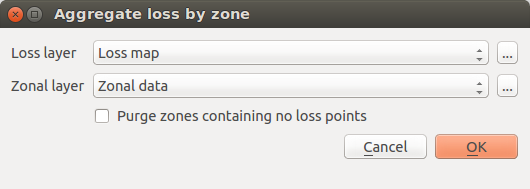
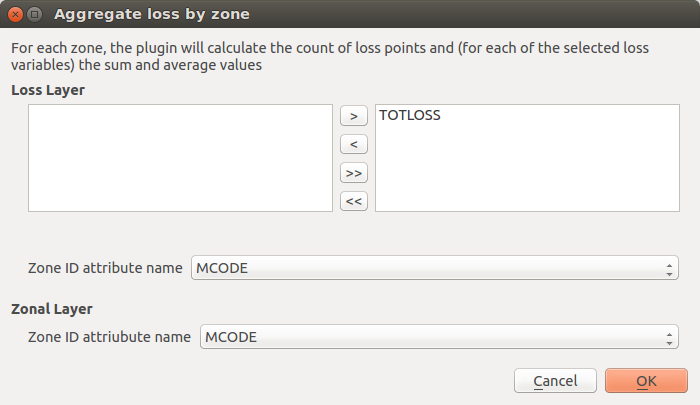

.. _chap-aggregating-loss-by-zone:

************************
Aggregating loss by zone
************************

.. _fig-aggregate-loss-by-zone:

    
    |icon-aggregate-loss-by-zone| *Aggregate loss by zone* data import tool

The development of an integrated risk model (IRI) arises from the convolution
of two main components: 1) estimations of physical risk (RI), and 2) a social
vulnerability index (SVI). The convolution of earthquake physical risk and
social vulnerability parameters can be accomplished by, first, importing risk
assessments from OpenQuake (or some other source) using the toolkit's risk
import tool (:numref:`fig-aggregate-loss-by-zone`). To import data, users can
click the :guilabel:`Aggregate loss by zone` button that prompts a dialog
window to open. Here, it is possible to select layers containing estimations of
physical risk, (*Loss layer*) or some other type of risk model, and to combine
these with a layer containing zonal geometries of the study area (e.g., country
borders, district borders) and socioeconomic indicators. The top dropdown menu
is pre-populated with the names of the available vector layers containing point
geometries (a native output of the OQ-Engine), while the second dropdown menu
is pre-populated with the names of the available vector layers containing
polygonal geometries. If those menus do not contain the desired layers, it is
possible to click one of the :guilabel:`...` buttons, to load another layer
from the file system. As soon as a new layer is loaded, it will be available in
the QGIS table of contents and its name will become available and pre-selected
in the corresponding dropdown menu.

Estimations of physical risk can be made available from the OQ-Engine as one or
multiple CSV files. By selecting the file
type :guilabel:`Loss curves from the OpenQuake-engine`, such files become available
and can be (multi)selected. The resulting loss layer will contain a number of
attributes equal to the number of CSV files imported, and each attribute will
correspond to a different loss type.

.. _fig-zonal-aggregation-of-loss-values:

    
    Zonal aggregation of loss values

Loss data from the OQ-Engine is rendered as points containing X,Y locational
coordinates and the loss values for the different assets represented at a given
location. Once both a loss layer and a zonal layer have been selected, the
above dialog window is opened
(:numref:`fig-zonal-aggregation-of-loss-values`). In the *Loss Layer*
section of the dialog window, the user is invited to select one or more
attributes from the loss layer. This selection is because the toolkit will
calculate the sum and average values for each of the zonal layer's features,
and it will add those statistics to the zonal layer as new attributes. Within
the layer's attribute table, a subsequent attribute will be added to display
the count of loss points that are found inside the boundaries of each feature.
The latter can be useful for troubleshooting.

.. warning::

    If SAGA is installed and sufficiently updated (at least version 2.3 is required),
    the plugin leverages its fast `Clip points in polygons` geospatial algorithm.
    Otherwise a fallback (slower but equivalent) algorithm is used. Please refer
    to :ref:`chap-installation` for further information on how to install or
    update SAGA.

The *aggregation by zone* can be obtained in different ways. If the user is
aware that both the loss layer and the zonal layer contain a common attribute
that indicates the id of the zone to which each feature belongs, then it is
sufficient to select this common attribute both for the loss layer and the
zonal layer, and let the tool perform a simple join. In this case, the
aggregation is fast because it does not require spatial analysis.

If a common zonal ID does not exist, a spatial join using zonal geometries may
be utilized. This is accomplished, first, by selecting :guilabel:`Use zonal geometries`
within the :guilabel:`Zone ID attribute name` dropdown menu that contains also the names
of all the attributes of the loss layer. As a consequence, the tool will
perform a spatial search to detect to which zone each of the loss points
belongs. The :guilabel:`Zone ID attribute name` in the zonal layer is the attribute that
uniquely identifies each of the zones. If the user is not sure if features are
uniquely identified by any of the available attributes in the zonal layer, then
it is possible to select the additional item :guilabel:`Add field with unique zone id`.
As a consequence of this choice, the tool will produce an additional attribute
in the corresponding layer, and it will set the values of that attribute to be
equal to the unique id of the corresponding feature. Then the new attribute
will be used as unique id of the feature, to perform the loss aggregation by
zone.

As a subsequent step, earthquake risk data imported into the tool should be
standardized to render the data commensurate to the socioeconomic indicators
created within the tool.

.. |icon-aggregate-loss-by-zone| image:: images/iconAggregateLossByZone.png
