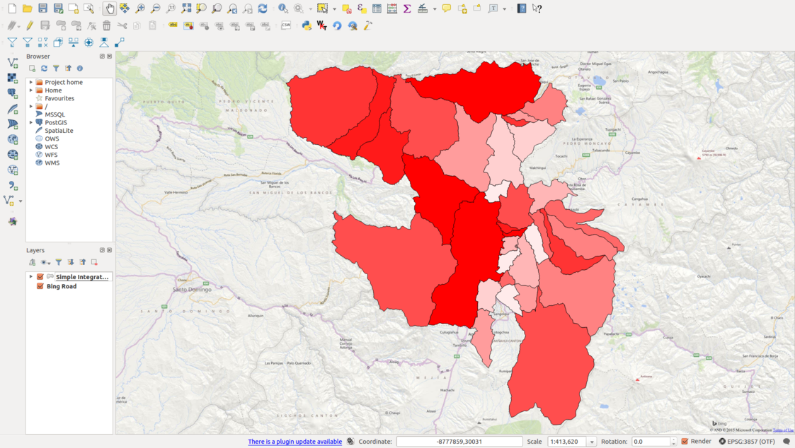
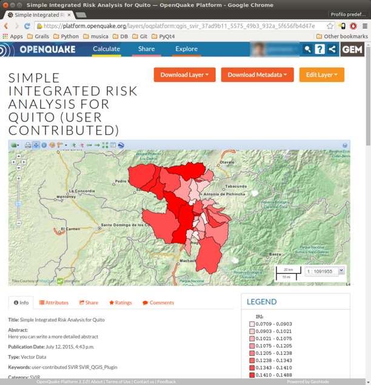
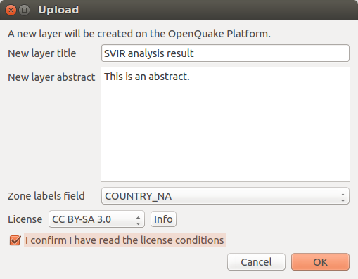
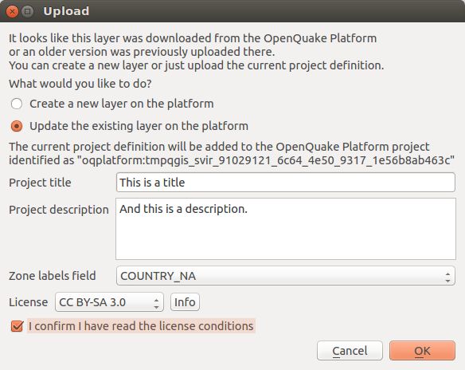

.. _chap-uploading-project-to-platform:

=============================================
Uploading a project to the OpenQuake Platform
=============================================

.. _fig-before-uploading:

    
    Simplified Integrated Risk analysis as it is seen inside QGIS
    right before the project is uploaded to the OpenQuake Platform

Once an integrated risk model is complete, and the user is satisfied with
results such as those obtained for the example displayed in
:numref:`fig-before-uploading`, it is possible to upload projects through
the OQ-Platform. Projects are uploaded in order to share them with the wider
earthquake risk assessment, earthquake risk reduction, GIS communities, etc.
Uploading to the OQ-Platform also  supports the ability to visualize models
using advanced visualization tools and the mapping of the data over the web. In
addition, sharing the models on the OQ-Platform allows users that are not QGIS
savvy to dynamically interact with the data. The mapping and visualization over
the web is accomplished using the OQ-Platform (:numref:`fig-after-uploading`)
and the Social Vulnerability and Integrated Risk Viewer (see
the `web application <https://platform.openquake.org/irv_viewer/>`_
and the corresponding `documentation
<http://www.globalquakemodel.org/openquake/support/documentation/platform/irv/>`_).

.. _fig-after-uploading:

    
    The same simple example shown in :numref:`fig-before-uploading`,
    visualized through a web browser after it has been uploaded to the
    OpenQuake Platform

To upload a project to the OQ-Platform, click *Upload project to the OpenQuake
Platform*. This will result in the opening of a dialog window in which,
depending on the context, the window will look like those delineated in
:numref:`fig-upload-dialog` or :numref:`fig-update-dialog`. The former
will be displayed if the current project has never been uploaded to the
OQ-Platform. In such cases, the user is invited to provide a project title that
will become the title of the layer that will be created on the
Platform. A second field will contain the abstract, where the user can provide
a general description of the project.

.. _fig-upload-dialog:

    
    |icon-upload| Uploading a project to the OpenQuake Platform

.. note::

    In order to be able to correctly utilize the advanced visualization tools
    found on the OQ-Platform, the selection of a *Zone labels field* is
    required (see :numref:`fig-upload-dialog`). 

The user must designate the :guilabel:`Zone labels
field` within their dataset. The latter is a field containing unique labels (or
identifiers) whether these are individual country names, district names, or
census block numbers, etc. Delineating a zone field when uploading to the
OQ-Platform is imperative to allow the graphing components of the Social
Vulnerability and Integrated Risk Viewer to render the visualization using the
zone's labels.  Without the latter, comparisons among places within the
graphing tools are not possible. It is also mandatory to choose a license and
to click on the checkbox to confirm to be informed about the license
conditions. By clicking the :guilabel:`Info` button, a web browser will be opened,
pointing to a page that describes the license selected in the :guilabel:`License`
dropdown menu. When :guilabel:`OK` is pressed, the active layer is uploaded to the
OQ-Platform and it is applied in the same style visible in QGIS. Furthermore,
the current project definition is saved into the layer's metadata,
inside the *Supplemental information* field.

.. _fig-update-dialog:

    
    Updating a project that has already been uploaded to the OpenQuake Platform

This second version of the *Upload* dialog window is displayed when the active
layer appears to have been already shared through the OQ-Platform (the ID of a
OQ-Platform's layer was previously associated with this layer). In such cases,
it is possible to create a brand new layer, ignoring the previously uploaded
(or downloaded) project, or to update the current layer. The updating process
consists of adding the current project definition to the set of project
definitions associated to that layer on the OQ-Platform. This is a much faster
procedure because no geometries need to be uploaded, and only the metadata of
the layer will be changed.

.. |icon-upload| image:: images/iconUpload.png

