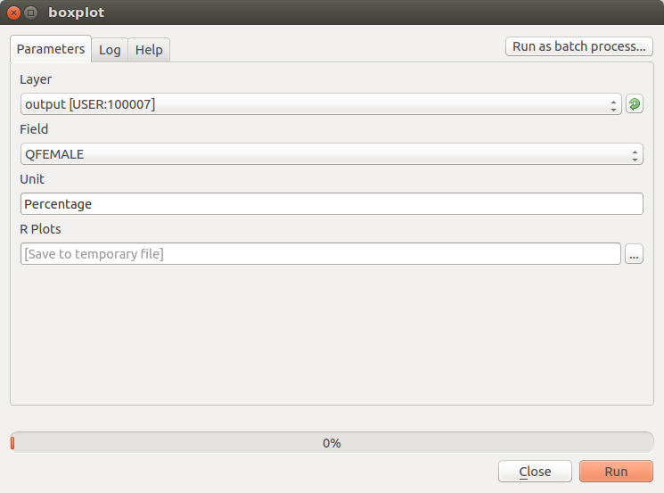
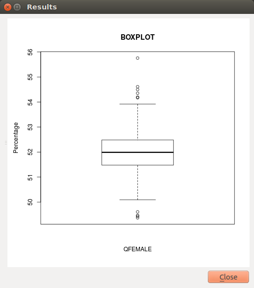

.. _chap-using_r_scripts:

****************************************************
Leveraging R to perform statistical analysis in QGIS
****************************************************

Socioeconomic analysis often involve statistical investigation, for instance for
dimensionality reduction in problems involving a considerable number of variables.
QGIS is well integrated with tools that can be leveraged for this
kind of purpose.
`R <https://www.r-project.org/>`_ is a well-known free software environment for
statistical computing and graphics. It is widely used and easily installable on
all the most used operating systems. QGIS enables users to drive R scripts from
within the `QGIS Processing
Toolbox <http://docs.qgis.org/2.0/en/docs/user_manual/processing/toolbox.html>`_.
`This documentation <https://docs.qgis.org/testing/en/docs/training_manual/processing/r_intro.html>`_
explains how to make R scripts available in the Processing Toolbox. You can create
your own scripts or download examples from a `public
repository <https://github.com/qgis/QGIS-Processing/tree/master/rscripts>`_.
Scripts can be managed and edited directly within QGIS, through an embedded
graphical widget. This feature is especially convenient to users who need to
quickly customize existing scripts. However, it does not provide the same
flexibility and interactivity that the R console offers, therefore the
coding process becomes a little more challenging.
By default, on unix-based systems, scripts are locally collected in
the directory `~/.qgis2/processing/rscripts` and they are identified by a file
like `scriptname.rsx`, that contains the script itself, and an optional file like
`scriptname.rsx.help`, that provides the corresponding documentation. An example
taken from the above public repository is the following:

File `Summary_statistics.rsx`:

.. code-block:: r

    ##Basic statistics=group
    ##Layer=vector
    ##Field=Field Layer
    Summary_statistics<-data.frame(rbind(sum(Layer[[Field]]),
    length(Layer[[Field]]),
    length(unique(Layer[[Field]])),
    min(Layer[[Field]]),
    max(Layer[[Field]]),
    max(Layer[[Field]])-min(Layer[[Field]]),
    mean(Layer[[Field]]),
    median(Layer[[Field]]),
    sd(Layer[[Field]])),row.names=c("Sum:","Count:","Unique values:","Minimum value:","Maximum value:","Range:","Mean value:","Median value:","Standard deviation:"))
    colnames(Summary_statistics)<-c(Field)
    >Summary_statistics

File `Summary_statistics.rsx.help`:

.. code-block:: json

    {"ALG_DESC": "This tool calculates the following summary statistics for a
                  numeric field: (1) Sum, (2) Count, (3) Unique values,
                  (4) Minimum value, (5) Maximum value, (6) Range, (7) Mean,
                  (8) Median and (9) Standard deviation.\n\n",
    "R_CONSOLE_OUTPUT": "Summary statistics table",
    "ALG_CREATOR": "Filipe S. Dias, filipesdias(at)gmail.com",
    "Layer": "Input vector with at least one numeric field",
    "Field": "Numeric field",
    "ALG_HELP_CREATOR": "Filipe S. Dias, filipesdias(at)gmail.com"}

Note that the header of the script contains some lines beginning with `##`.
These lines are used by the QGIS Processing Toolkit to build a graphical user
interface that will be displayed every time the script is launched, and that
enables users to graphically set up some parameters that will be used by the script.
In the example, for instance, a dropdown menu will list all the available
vector layers; once a layer is selected, another dropdown menu will list all
its fields. Please refer to `the QGIS
documentation <http://docs.qgis.org/2.8/en/docs/user_manual/processing/3rdParty.html#r-creating-r-scripts>`_
for a more detailed description of the script syntax.

A brief list of statistical techniques that are often needed in socioeconomic analysis,
that are all available in R, are as follows:

* Summary statistics (mean, median, high value, low value, standard deviation)

* Boxplots as well as measures of skewness and curtosis

* Histograms

* Scatter plotting

* Correlation (Pearson's R, Spearman Rank, Kendall's Tau)

* Cronbach's Alpha (which is based on correlation)

* Principal Components Analysis/Factor Analysis

Some of these require the statistical platform to take into account one single field (e.g., summary
statistics) or a couple of fields (e.g. scatterplot). In such cases, it is
sufficient to add parametric references to those fields into the header of the script.
Things become more complicated where the number of parameters required is not known in
advance, as in the case of Principal Components Analysis. In older versions of QGIS, `the
widgets that can be used through the script header
syntax <http://docs.qgis.org/2.0/en/docs/user_manual/processing/modeler.html#definition-of-inputs>`_
did not include a multiselection functionality.
Therefore, it was impossible for the user to graphically select an indefinite
number of fields from the complete list. However, even without a multiselect widget,
it was possible to let a
script perform the analysis on the whole set of numeric fields available in the
selected layer. In order to exclude some numeric fields from the
analysis, we can add to the script header the reference to a textual field to
be added to the GUI, in which the user can insert a list of comma-separated
names of fields to be ignored. The script becomes something like:

.. code-block:: r

    ##Basic statistics=group
    ##Layer=vector
    ##Exclude=String
    layerData <- data.frame(Layer)
    numericFields <- sapply(layerData, is.numeric)
    numericData <- layerData[, numericFields]
    excludedFields <- trimws(strsplit(Exclude, ",")[[1]])
    analyzedData <- numericData[, !(names(numericData) %in% excludedFields)]
    comps <- prcomp(analyzedData, scale=TRUE)
    >comps

Since a multiple selector for layer fields has been made available,
it is possible to run R algorithms such as in the following example,
using the `multiple field` widget type:

.. code-block:: r

    ##Basic statistics=group
    ##Layer=vector
    ##ChosenFields=multiple field Layer
    layerData <- data.frame(Layer)
    numericFields <- sapply(layerData, is.numeric)
    numericData <- layerData[, numericFields]
    chosen <- trimws(strsplit(ChosenFields, ";")[[1]])
    analyzedData <- numericData[, names(numericData) %in% chosen]
    comps <- prcomp(analyzedData, scale=TRUE)
    >comps

This script creates automatically a graphical user interface that first lets the user
select one of the available layers. Once the layer is selected, the corresponding fields
are listed in a multi-select widget, where a set of them can be chosen. As soon as the
`Run` button is pressed, the algorithm collects the chosen fields and it performs
the Principal Components Analysis on them, excluding the non-numeric ones that might
have been erroneously selected.

What if we want to build a vector layer using the results of a calculation
performed by R? Examples of this are available in the documentation linked
above. The following example shows how to load a vector layer
from those available in QGIS, make a copy of it, perform a calculation,
save the result in a new field of the new layer, and make the final
layer available in QGIS. In this basic example, the calculation is extremely
simple, just summing the values of two fields. However, it can
be easily extended to obtain complex results.

.. code-block:: r

    ##Vector processing=group
    ##Layer=vector
    ##First=Field Layer
    ##Second=Field Layer
    ##output=output vector
    modified <- data.frame(Layer)
    modified['SUM'] <- NA
    modified$SUM <- Layer[[First]] + Layer[[Second]]
    output=SpatialPolygonsDataFrame(Layer, as.data.frame(modified))

We have just seen in the latter example that the output of a script can be a
vector layer (`##output=output vector`). In the previous example, `>comps`
indicated to the Processing Toolkit that the object `comps` had to be shown
to the user as text in a dedicated output window. A third possibility is
to display the output as a plot, using the `##showplots` directive
as follows:

.. code-block:: r

    ##Vector processing=group
    ##showplots
    ##Layer=vector
    ##Field=Field Layer
    ##Unit=String
    boxplot(Layer[[Field]], main="BOXPLOT", xlab=paste(Field), ylab=paste(Unit))

.. _fig-boxplotDialog:

    Boxplot Dialog Window

When the script is executed, the dialog shown in :numref:`fig-boxplotDialog` allows
the user select one of the available layers, then one of its fields. In the
:guilabel:`Unit` text field, the user can write the measurement unit to be displayed in
the y label in the plot.  By pressing :guilabel:`Run`, R is started, running the
`boxplot` function on the selected data and setting the plot labels accordingly
(see :numref:`fig-boxplotOutput`).

.. _fig-boxplotOutput:

    Boxplot Output Window
