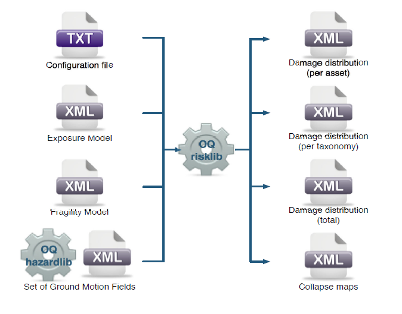

.. _chap-recovery-modeling:

**********************************************
Post-Earthquake Recovery Modelling Methodology
**********************************************

This work was supported by the State of California, Alfred E. Alquist Seismic
Safety Commission and is part of a collaborative effort between the Global
Earthquake Model (GEM) and the University of California at Los Angeles (UCLA),
Department of Civil and Environmental Engineering. GEM implemented the
scientific methodology developed by UCLA [BDL+15]_ and integrated it into
the QGIS framework as part of the IRMT plugin.

This computational tool was developed to quantify the effectiveness of specific
resilience-building actions (preparedness, mitigation, and response) that would
enhance the process of recovery following an earthquake. Building performance
is assessed using metrics that are explicitly linked to community seismic
resilience such as functionality, occupiability and repairability. A
probabilistic approach to mapping the fragility function parameters for the
loss-based damage states used in OpenQuake and HAZUS (e.g. slight, moderate,
extensive, complete) to the recovery-based damage states (e.g. functional loss,
uninhabitable, irreparable) that are needed to assess seismic resilience is
applied. A discrete state-based stochastic simulation model is used to quantify
recovery trajectories for damaged buildings. Deterministic recovery paths
conditioned on the post-earthquake damage state are described by discrete
recovery states and the time spent in each state. The uncertainty in the
recovery trajectory is captured by generating multiple realizations of the
recovery path (Monte Carlo Simulation) accounting for the uncertainty in the
time spent in each state. The function that describes community-level (or
neighborhood-level) recovery is obtained by aggregating the recovery curves for
the individual buildings after accounting for the variation in shaking and
damage at each site and various exogenous and endogenous factors that affect
the pace of recovery.

This tool provides an effective way to engage key stakeholders from
government, industry and other groups, who are concerned with enhancing
post-disaster recovery of communities. For example, focus groups
with practitioners and emergency managers can be held to demonstrate its
capabilities and explore their questions and concerns with regards to
post-earthquake recovery. By allowing them to explore various trajectories for
specific earthquake scenarios, the simulator will assist policy-makers,
municipal governments and planners in understanding the possible interventions
and tradeoffs associated with post-earthquake recovery. The simulation model
can also be used to investigate hypotheses derived from findings and
conclusions from previous earthquakes. Hypothesis examples include the
following:

#. increased utility restoration rates increase recovery rates,
#. higher insurance penetration rates reduce household displacement,
#. designing for higher building performance levels prevents outmigration
   from the city, and
#. 'residential red zones' or temporary building moratoriums are preferable
   to patchwork reconstruction.

The recovery framework previously described was incorporated into this plugin,
resulting in a dynamic and user-friendly software tool for generating both
building-by-building and community level post-earthquake recovery predictions.
The IRMT allows users to:

#. incorporate their local knowledge and data;
#. develop composite indicators (or indices) to measure social vulnerability
   and/or disaster resilience;
#. integrate these indices with physical risk estimates from OpenQuake or other
   software platforms; and
#. visualize the results.

In the following steps, a brief description of the basic workflow to develop an
end-to-end recovery prediction is presented, where the main features and
capabilities of the tool are highlighted.

.. _sec-inputFilesForOqEngine:

Preparation of the input files for the OpenQuake Engine analysis
================================================================

The recovery modelling algorithm
requires users to provide a CSV file containing the probability of exceedance
of each limit state for each individual building in the exposure model. The
latter can be computed by running a Scenario Damage Assessment, which is a type
of analysis supported by the risk component of the OpenQuake Engine.
The input
files necessary for running a scenario damage calculation and the resulting
output files are depicted in :numref:`fig-oqEngineInputFiles` For technical details, definitions
and examples of each component, readers are referred to [PMW+14]_ and [SCP+14]_.

.. _fig-oqEngineInputFiles:

    Scenario Damage Calculator input/output structure

The window
that requests users to upload the input files and run the scenario damage
calculation is shown in :numref:`fig-dialogDriveOqEngine`.

It should be noted that in order to use the OpenQuake Engine from QGIS, the
user needs to set up the connection with a working OpenQuake Engine Server
using the :ref:`chap-irmt-settings` dialog; the server can be installed in
the same machine where the plugin is used. Alternatively, it is possible to use
a remote server or cluster.

.. _sec-recovery-modeling-settings:

Setting up the configuration variables to run the recovery modelling algorithm
==============================================================================

The configuration variables that are necessary to perform the recovery modeling
analysis can be edited using the dialog shown in :numref:`fig-dialogRecoveryModelingSettings`.

.. _fig-dialogRecoveryModelingSettings:

.. figure:: images/dialogRecoveryModelingSettings.png
    :align: center
    :scale: 60%

    Recovery modeling settings dialog

The following variables should be adjusted to the available data and needs of
the user:

+-----------------------------------------+---------------------------------------------------------------------------------------------------------------------------------------+
| **Configuration variable**              | **Explanation**                                                                                                                       |
+=========================================+=======================================================================================================================================+
| Number of loss-based damage states      | Default is 5 (no damage, slight, moderate, extensive, complete)                                                                       |
+-----------------------------------------+---------------------------------------------------------------------------------------------------------------------------------------+
| Number of functional-based limit states | Default is 6 (no damage, trigger inspection, loss function, not occupiable, irreparable, collapse)                                    |
+-----------------------------------------+---------------------------------------------------------------------------------------------------------------------------------------+
| Transfer Probabilities                  | The element (i, j) of the matrix is the probability that the recovery-based limit state j occurs, given the loss-based damage state i |
+-----------------------------------------+---------------------------------------------------------------------------------------------------------------------------------------+
| Assessment times                        | Time to conduct engineering assessment                                                                                                |
+-----------------------------------------+---------------------------------------------------------------------------------------------------------------------------------------+
| Inspection times                        | Time to complete inspections                                                                                                          |
+-----------------------------------------+---------------------------------------------------------------------------------------------------------------------------------------+
| Mobilization times                      | Time to mobilize for construction                                                                                                     |
+-----------------------------------------+---------------------------------------------------------------------------------------------------------------------------------------+
| Recovery times                          | Period between the occurrence of the earthquake and the restoration of full functionality                                             |
+-----------------------------------------+---------------------------------------------------------------------------------------------------------------------------------------+
| Repair times                            | Time to replace building                                                                                                              |
+-----------------------------------------+---------------------------------------------------------------------------------------------------------------------------------------+
| Repair times dispersion                 | Level of uncertainty associated with the repair times                                                                                 |
+-----------------------------------------+---------------------------------------------------------------------------------------------------------------------------------------+
| Lead times dispersion                   | Level of uncertainty associated with the lead times                                                                                   |
+-----------------------------------------+---------------------------------------------------------------------------------------------------------------------------------------+

The list of the outputs from the Scenario Damage calculation can be visualized
in :numref:`fig-dialogDriveOqEngine`. The tool offers the possibility to load the 'Damage by asset'
CSV file (dmg_by_asset) as a QGIS vector layer, stored in
the user's computer as a shapefile. In addition, it is possible to
automatically style the layer with respect to a chosen damage state.
Alternatively, the user can upload on QGIS the 'Damage by asset' CSV file,
structured in the same format as produced by the OpenQuake Engine. If the user
does not need to edit the layer by adding or removing fields to/from it, it is
possible to perform the recovery modelling calculation using the CSV-based
layer. Otherwise, the layer should be converted and saved as a shapefile.
Please note that shapefile limitations will reduce the field names to a maximum
length of 10 characters each. At this point, the user may choose between two
workflows on how to proceed to the generation of single buildings and/or
community level recovery curves.

Interactive workflow
====================

The user can select individual buildings (or a group of buildings) and the
respective recovery curve (single or aggregated) is automatically developed.
The curve can be edited, digitized and exported as a CSV, as well as saved as
an image. The user requests the development of recovery curves by selecting the
relevant layer, opening the :guilabel:`IRMT Data Viewer` (making sure that the
:guilabel:`Toggle viewer dock` option is checked in the IRMT menu), and setting
the :guilabel:`Output Type` tab to :guilabel:`Recovery Curves`. One of two
available algorithmic approaches, regarding the estimation of the recovery, has
to be chosen. The :guilabel:`Aggregate` approach produces the recovery model as
a single process, whereas the :guilabel:`Disaggregate` approach takes into
account four processes: inspection, assessment, mobilization and repair. In
addition, the user can manually select the fields of the layer that contain the
probabilities of being in each damage state (:numref:`fig-dataViewerRecovery`). If the file with
the damage state probabilities is in the same format as produced by OpenQuake,
the software pre-selects the appropriate fields for the recovery modelling
algorithm. The number of simulations per building is the number of damage
realizations used in Monte Carlo Simulation.

.. warning:: Increasing the number of simulations, the model becomes more
   accurate, but the calculation becomes slower and more expensive in terms of
   memory consumption

It should be emphasized that the integration of the recovery modelling
algorithm in the QGIS software enables the users to adapt the workflow to their
needs, leveraging all the features provided by the QGIS framework. The QGIS
Processing Toolbox gives access to a wide variety of geoalgorithms, seamlessly
integrating several different open-source resources, such as R, SAGA or GDAL.
For instance, a SAGA algorithm, the 'Add Polygon Attributes to Points', can be
used to aggregate by zone a set of selected assets, resulting in relating each
asset to the identifier of the geographical area (zone) where it belongs.
Following, the selection of the set of assets to be considered in the analysis
can be performed in several different ways. The user can directly select points
by clicking them on the map, or select points by using a formula. If points
have been labeled with the identifier of the zone, the selection can be done
with respect to the zone identification (or ID).

Batch workflow
==============

Initially, the user must select the layer containing the information regarding
the damage state probabilities per asset (see
:ref:`sec-inputFilesForOqEngine`), after which the specific fields that
contain these probabilities shall be opted. Next, the user must select a
specific recovery time approach (Aggregate/Disaggregate) and set the number of
simulations per building (number of damage realizations used in Monte Carlo
Simulation). Here, it is possible to select the layer of the study area with
zonal geometries and generate aggregated recovery curves by zones.

.. _fig-batchRecoveryModeling:

.. figure:: images/batchRecoveryModeling.png
    :align: center
    :scale: 60%

    Dialog to perform recovery modeling on the whole data set (also enabling zonal aggregation)

By unchecking the :guilabel:`Aggregate assets by zone` box
(:numref:`fig-batchRecoveryModeling`) the algorithm generates a single community
recovery curve by aggregating the recovery curves of all the buildings within
the region. The graphs, like the one shown in :numref:`fig-recoveryPlot`, are
saved in the output directory designated by the user. In addition,
building-by-building recovery curves are digitized and can be saved as text
files (.txt) in the same output directory. The user can decide whether or not
to generate the building-by-building recovery curves by (un)checking the
:guilabel:`Save individual building curves` tab. The data can be further used
(e.g. with a spreadsheet editor like LibreOffice Calc or Microsoft Excel)
to generate and visualize individual building recovery curves that may be of
interest to the user.

.. _fig-recoveryPlot:

.. figure:: images/recovery_function_zone_6014.png
    :align: center
    :scale: 60%

    The community-level recovery function for one of the zones under analysis, showing
    how the normalized recovery level evolves with time after the earthquake
