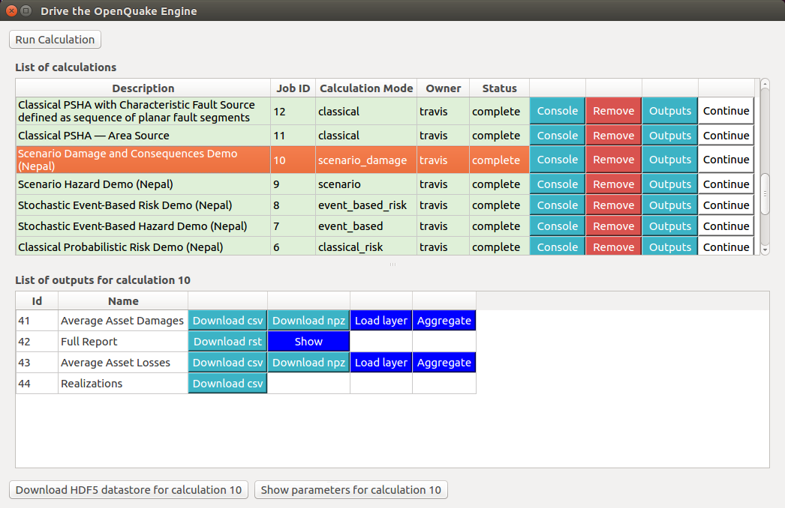
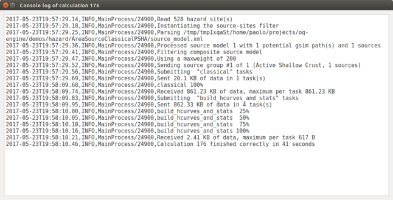
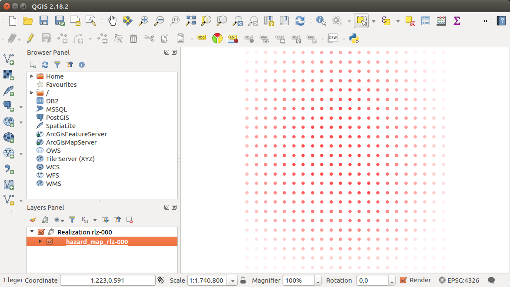

.. _chap-drive-oq-engine:

****************************
Driving the OpenQuake Engine
****************************

.. _fig-dialogDriveOqEngine:

    Dialog to run the OpenQuake Engine server

The plugin enables to drive the `OpenQuake Engine
<https://github.com/gem/oq-engine>`_, submitting new jobs, watching calculation
progress, retrieving and visualizing results, seamlessly within the QGIS
interface. This is made possible by leveraging the OpenQuake Engine
Server's `HTTP RESTful API <https://github.com/gem/oq-engine/blob/master/doc/web-api.md>`_.
The connection with a running OQ-Engine Server has to be properly set up as described
in :ref:`chap-irmt-settings`. The server can run locally in the same computer where
QGIS is running, or remotely. For instance, it is possible to connect to a remote
cluster, to perform jobs that are highly demanding in terms of computational resources.

Run a calculation
===================

When the :guilabel:`Run Calculation` button is pressed, a file explorer is opened,
enabling to select the input files needed to run the job (or a zip archive
containing them), including the `job.ini` file. By pressing :guilabel:`Open` to confirm,
the job is submitted. The interface keeps querying the server asynchronously, and
displaying the status of the calculation.

Watch the console log
=====================

It is possible to watch the log of a calculation, by pressing the
:guilabel:`Console` button in the corresponding row. The log will be
displayed in a tab of the QGIS :guilabel:`Log Message Panel`, as shown
in :ref:`fig-calculation-log`.

.. _fig-calculation-log:

    Example of console output for a OQ-Engine calculation 

Download outputs
================

If a calculation was completed successfully, an :guilabel:`Outputs` button is
provided. When it is clicked, the list of available outputs is shown, which
depends on the type of artifacts generated by the calculation. Outputs can be
downloaded in one of the available formats, by clicking the corresponding
button. In some cases, they can also be loaded as QGIS layers (whenever a
corresponding :guilabel:`Load as layer` button is available), and a default
styling is applied, based on parameters chosen by the user.

.. warning:: The layers that are automatically imported from OQ-Engine outputs
             are stored `in memory`, unless they are explicitly saved by the
             user into a persistent format, such as a shapefile. Please be
             aware that the contents of `in memory` layers will not be saved
             when the QGIS project that contains them is saved.  Furthermore,
             saving an `in memory` layer into a persistent file, only the
             contents of the layer will be saved, and not its style. If you
             want to save also the style, you have to right-click on the
             original layer and select :guilabel:`Styles -> Copy Style`, and
             then do the same on the target persistent layer and select
             :guilabel:`Styles -> Paste Style`.

It is also possible to download the HDF5 datastore corresponding to a chosen
calculation. When the :guilabel:`Outputs` button is pressed, the
:guilabel:`Download HDF5 datastore for calculation N` button is enabled (where
`N` is the calculation ID). By pressing it and selecting a destination folder,
the file is downloaded and its full path is displayed both in the QGIS message
bar and in the :guilabel:`Log Messages Panel`.

A hazard map defines the geographic distribution of the values of a scalar IMT
(see also :ref:`chap-definitions`) characterized by a fixed probability of
being exceeded at least once in a time span T. For computing a hazard map with
the OpenQuake-engine the user defines an IMT, a region over which the map will
be computed and, the corresponding probability of exceedance. An alternative
representation of a hazard map fixes the value of IMT and computes over an area
the corresponding probability of at least on exceedance in T; this typology of
result is currently not supported by the OpenQuake-engine.

Other kinds of outputs (e.g. hazard curves and uniform hazard spectra) can be
visualized in the IRMT Data Viewer (see :ref:`chap-viewer-dock`).

.. _fig-hazard-map:

    Example of a hazard map produced by the OpenQuake Engine

Run a postprocessing (or risk) calculation on top of a previously computed hazard
=================================================================================

To run a postprocessing or risk calculation on top of a previous hazard one you
have to click the :guilabel:`Continue` button on the corresponding hazard
calculation and select the files including the postprocessing or risk `job.ini`
and the related inputs (or a zip archive containing them).

Remove a calculation
====================

To remove a calculation, press the :guilabel:`Remove` button.
It will remove the calculation from the list, from the database and
from the datastore.

Calculation status
==================

The :guilabel:`Status` column of the :guilabel:`List of calculations` indicates
the current status of a calculation, which can be one of the following:
`created`, `executing`, `complete`, `failed`.

The reason behind a `failed` calculation can be inspected by watching the
console log, by means of the :guilabel:`Console` button.
