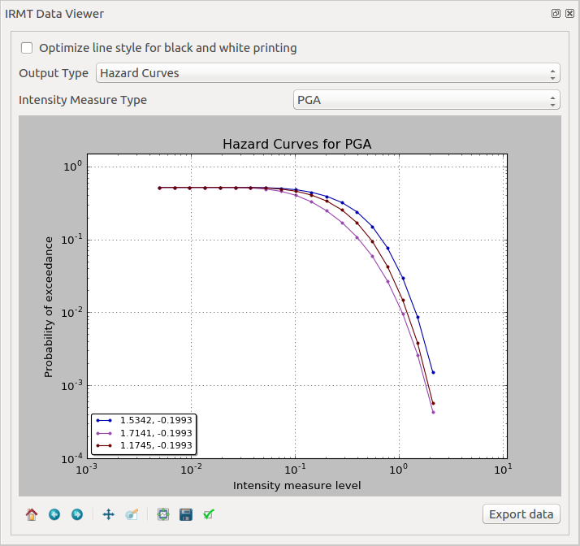
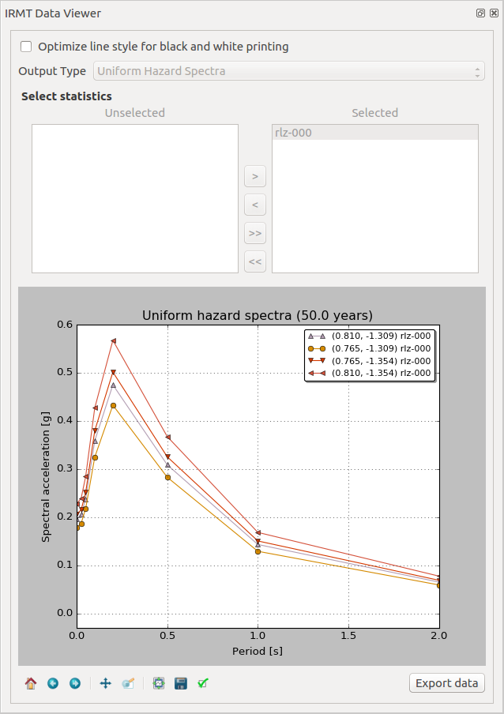

.. _chap-viewer-dock:

********************
The IRMT Data Viewer
********************

The IRMT Data Viewer is a dock window added to QGIS by the IRMT plugin,
used for data visualization. It is shown/hidden by pressing the
button :guilabel:`Toggle IRMT Data Viewer`.

In its initial state, the window displays a :guilabel:`Output Type` selector,
that enables to trigger the visualization of different types of data, and
an initially empty plotting area.

The viewer can plot some of the outputs produced by the OpenQuake Engine,
such as hazard curves and uniform hazard spectra, and recovery curves (see
also :ref:`chap-definitions`).

When a layer containing compatible data is activated in the QGIS and the
corresponding output type is selected, the viewer is ready to visualize
the outputs corresponding to the features that will be selected in the map.

Plots are obtained using the *Matplotlib* library. Below the plotting area,
Matplotlib provides a toolbox with standard functionalities that enable
modifying markers, labels, axes, zooming level and other parameters, saving the
plot to file and exporting the selected curves into a csv format.

Visualizing hazard curves
=========================

A hazard curve defines the relation between a scalar IML and the probability of
at least one exceedance of that IML within a time span T. The OpenQuake-engine
computes discrete hazard curves described by a two-dimensional array containing
a first column of n values of an IMT and a second column including values of
the probability of exceedance of the resultant IML in the time span T (which is
indicated in the OpenQuake-engine configuration file). A hazard curve is the
primary result of a PSHA analysis for a particular site. From hazard curves it
is possible to compute other result-typologies such as hazard maps and uniform
hazard spectra.

As described in :ref:`chap-drive-oq-engine`, the plugin enables to run
hazard calculations and to download the corresponding outputs. For outputs
of type `hcurves`, it is possible to load the data into a QGIS layer by
pressing the button :guilabel:`Load npz as layer`. The layer will contain,
for each point, the set of intensity measure levels and the corresponding
values of probability of exceedance, for each of the available intensity
measure types. While the layer is active, it is possible to select the
:guilabel:`Output Type` :guilabel:`Hazard Curves`, to activate the
visualization. When one or more points are selected in the map, the hazard
curves for the chosen :guilabel:`Intensity Measure Type` are plotted together
(:numref:`fig-dataViewerHazardCurves`). The legend also specifies the longitude
and latitude of the points corresponding to each of the curves in the plot. By
hovering on the legend items or on the curves, the corresponding points in the
map are highlighted.

.. _fig-dataViewerHazardCurves:

    IRMT Data Viewer used for displaying hazard curves

Visualizing uniform hazard spectra
==================================

A Uniform Hazard Spectrum (UHS) is a typology of result that is site-specific –
as in the case of hazard curves. A UHS defines a relationship between the
period (or frequency) of a period-dependent (or frequency-dependent) IMT such
as spectral acceleration and the resulting IMT value with a fixed probability
of exceedance in a time span T.

The workflow to visualize uniform hazard spectra is almost the same as the one
described above for visualizing hazard curves. In this case, the
:guilabel:`Output Type` to be loaded as layer is :guilabel:`Uniform Hazard
Spectra` (:numref:`fig-dataViewerUHS`).

.. _fig-dataViewerUHS:

    IRMT Data Viewer used for displaying Uniform Hazard Spectra

Visualizing recovery curves
===========================

.. _fig-dataViewerRecovery:

.. figure:: images/dataViewerRecovery.png
    :align: center
    :scale: 60%

    IRMT Data Viewer used for recovery modeling analysis

Please refer to :ref:`chap-recovery-modeling` for a general overview of
the recovery modeling workflow, its scientific background and the description
of the parameters and of the configuration files.

When one point is selected in the map, the corresponding building-level
recovery curve is plotted. By selecting two or more points, the
corresponding community-level recovery curve is displayed.

The selection can be made by clicking points directly in the map, or by
leveraging other selection tools available in QGIS. For instance, it
might be useful to select buildings that share a specific taxonomy.
In order to do so, it is sufficient to click the
:guilabel:`Select features using an expression` button in the QGIS
toolbar, and to use the expression editor to perform the desired query.
A useful example could be an expression such as:
`"taxonomy" LIKE 'LC-%'`, that would select all those features for which
the `taxonomy` field begins with the string `"LC-"`, i.e., all "low
building code" assets.
