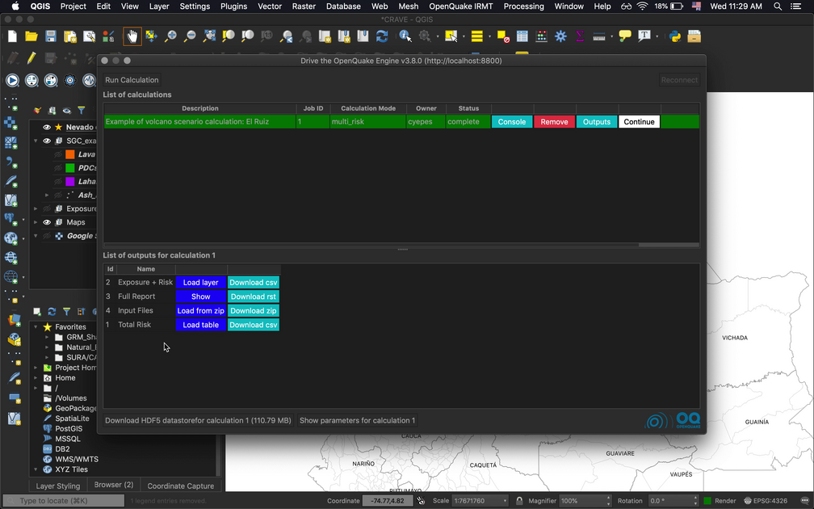
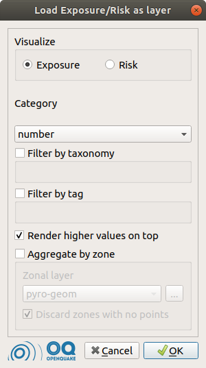
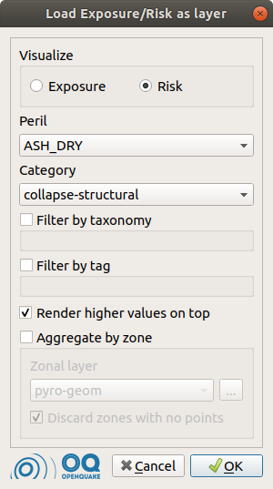
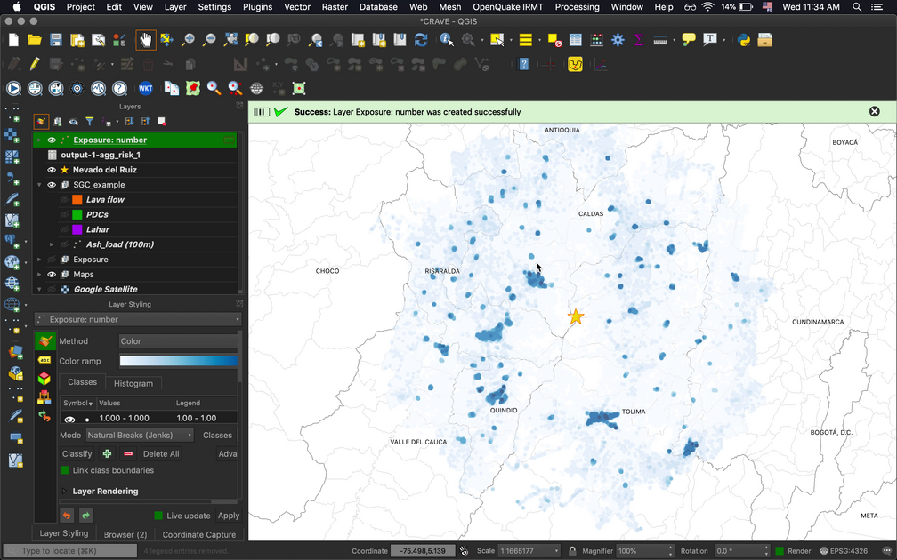
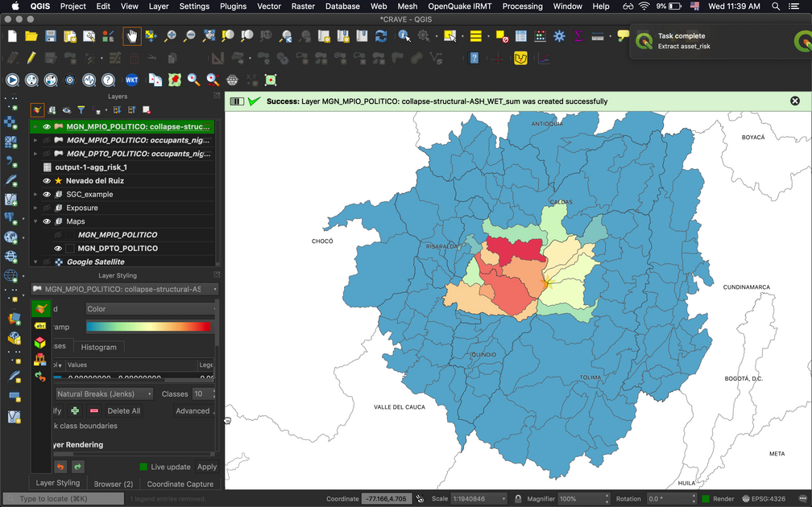
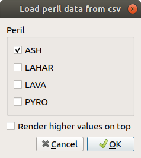
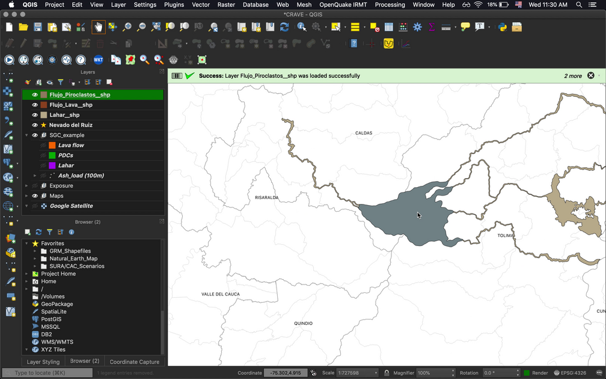
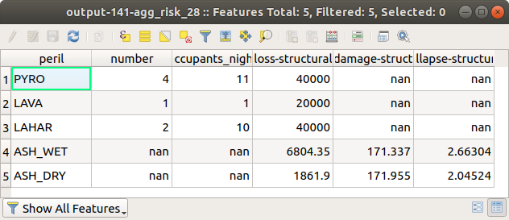

.. _chap-crave:

*********************************************************
Visualizing OpenQuake Volcano Scenario Calculator outputs 
*********************************************************

The volcano scenario calculator serves as a pilot case for using
OpenQuake-engine to assess risk due to hazards different than earthquakes.
Detailed information for earthquake analyses is available in the
`user manual of the OpenQuake Engine <https://docs.openquake.org/oq-engine/stable/>`_.

.. _fig-craveListOutputs:

    List of outputs for a multi_risk calculation.

Visualizing Exposure + Risk 
===========================

By pressing the :guilabel:`Load layer` button corresponding to the
:guilabel:`Exposure + Risk` row in the list of outputs for the :guilabel:`multi_risk`
calculation, the dialog in figures :ref:`fig-viewExposure` and :ref:`fig-viewRisk`
will be displayed:

.. _fig-viewExposure:

    Dialog to select parameters for the visualization of exposure.
    
.. _fig-viewRisk:

    Dialog to select parameters for the visualization of risk.

Selecting the corresponding radio button, it is possible to visualize either
the exposure or the risk. In
this example, the exposure can be considered in terms of number of buildings or
occupants, or in terms of structural value. For what concerns the risk, it is
possible to select the kind of peril to take into account (in this case: dry or
wet ash, lava, lahars or pyroclastic flow) and the category of interest (e.g.:
structural collapse, loss or no-damage).

Both for exposure and risk, it is possible to filter the available data by
taxonomy and/or by tag. One or multiple items of interest can be chosen
(multiple taxonomies and/or multiple values per one of the available tags).

The checkbox :guilabel:`Render higher values on top` is checked by default, as it is
recommended. It prevents features with smaller values from overlapping more
interesting, higher-valued features that might be located at the same
coordinates or very close to them.

Once all the parameters above are set, it is possible to load the corresponding
data as a QGIS layer, by pressing the :guilabel:`OK` button. If the :guilabel:`Aggregate by zone`
checkbox is not selected, the resulting layer will contain points at the
coordinates for which the output data has been calculated. It is also possible
to press the :guilabel:`OK` button after checking :guilabel:`Aggregate by zone` and selecting a
layer containing polygonal geometries (e.g., each polygon may represent the
boundaries of a different municipality). In this case, a geospatial aggregation
is performed, summing the values of points contained in each polygon.

In both cases, with or without zonal aggregation, the layer that is produced
will be styled automatically.

    An example of exposure map in terms of number of buildings.

    An example displaying the estimated number of buildings per region that would collapse due to wet ash fall.

Visualizing Input Files
=======================

By pressing :guilabel:`Load from zip`, the following dialog is displayed.

    Dialog to select the input files corresponding to the footprints of the perils to be visualized. 

It allows to visualize the input data corresponding to the selected perils.
Also in this case, it is possible to check :guilabel:`Render higher values on top`, in
order to avoid hiding interesting high-valued points below other rendered
points.

    An example of volcano footprint input.

Visualizing Total Risk
======================

By pressing :guilabel:`Load table`, the plugin will display a summary of the
total risk for each of the analyzed perils, with respect to each category of
risk and exposure.

    Table summarizing the total risk.

.. note::
   The style that is assigned automatically to the layers might need to be
   slightly modified on a case-by-case basis, for instance modifying the
   classification criteria, e.g. changing the number of classes and/or the
   classification mode (using equal intervals, quantiles, pretty breaks, etc.). A
   convenient way to do so is to use the "Layer styling" panel and select one of
   the available layers to visualize and modify its styling settings. The same can
   be obtained by double clicking one of the listed layer names, thus opening the
   layer properties dialog, and using the functionalities offered by the
   "Symbology" tab.
