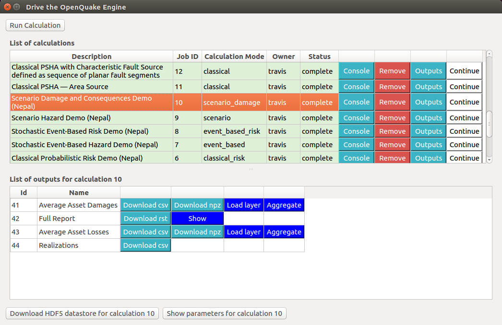

.. _chap-crave:

*****
CRAVE
*****

This is a `link <http://www.google.it>`_.

This is a code block:

.. code-block:: bash

    $ sudo pip3.6 install matplotlib scipy

This is a warning block:

.. warning::

    This is the content
    This is more content

And this is a note block:

.. note::

    This is the content
    This is more content

If you have any gui label, you can use :guilabel:`this`.

You can have sections:

How to run tests on Ubuntu 18.04 LTS
====================================

You can add inline code:
``python3-scipy``, ``python3-nose``, ``python3-coverage``, ``python3-mock``

You can have bulleted lists:

* First

  You can use cross references and inline images:
  * |icon-load-indicators| :ref:`chap-load-indicators`

* Second

You can add numbered lists:

1. First

2. Second

You can insert figures:

.. _fig-dialogDriveOqEngine:

    |icon-drive-oq-engine| Dialog to run the OpenQuake Engine server

You can add bibliography:
[PMW+14]_ and [SCP+14]_

.. [PMW+14]
    Pagani, M., Monelli, D., Weatherill, G., Danciu, L., Crowley, H., Silva,
    V., Henshaw, P., Butler, L., Nastasi, M., Panzeri, L., Simionato, M. and
    Vigano, V. OpenQuake Engine: An Open Hazard (and Risk) Software for the
    Global Earthquake Model. Seismological Research Letters, vol. 85 no. 3,
    692-702

.. [SCP+14]
    Silva, V., Crowley, H., Pagani, M., Monelli, D., and Pinho, R., 2014.
    Development of the OpenQuake engine, the Global Earthquake Model’s
    open-source software for seismic risk assessment. Natural Hazards 72(3),
    1409-1427.

.. |icon-load-indicators| image:: images/iconLoadIndicators.png
.. |icon-drive-oq-engine| image:: images/iconDriveOqEngine.png
